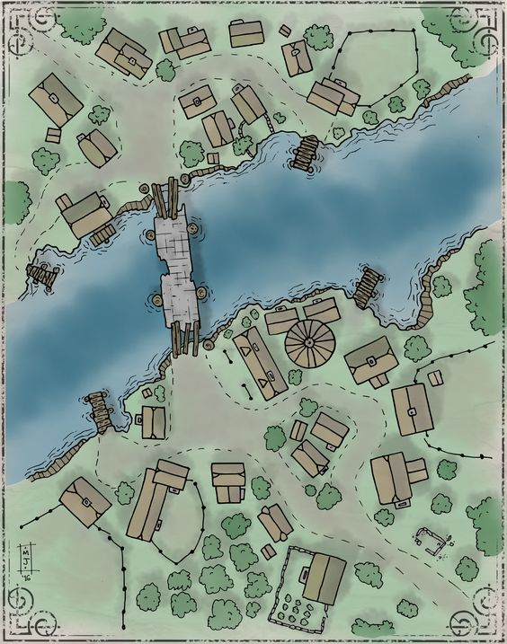

# PostmanJs

📬 A postman searching for the best way to work using a graph data structure in JavaScript.

  
  
(Village - font: Pinterest)

1. -
2. -
3. -
4. -
5. -
6. -
7. -
8. -
9. -
10. -
11. -
12. -
13. -
